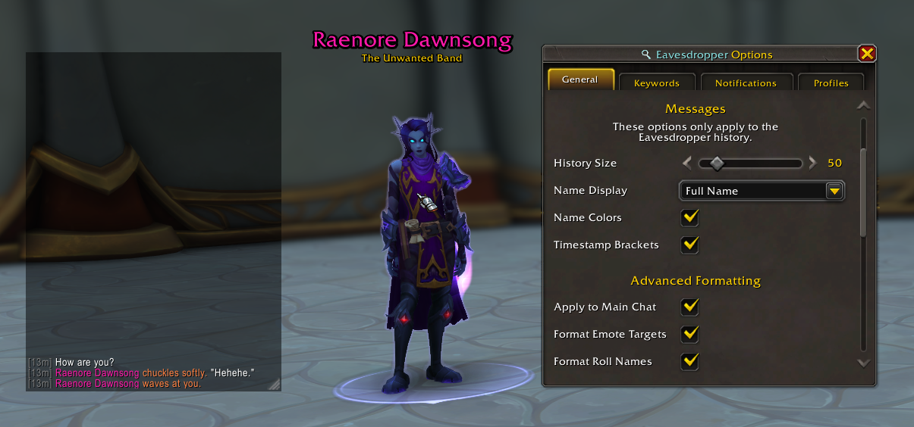
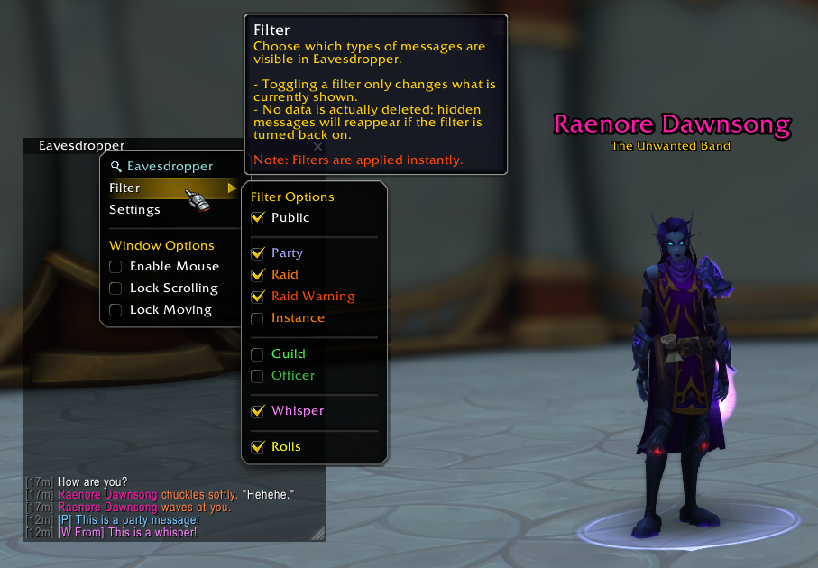
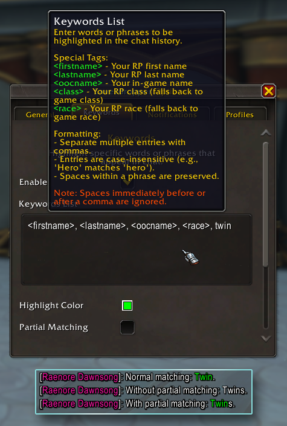
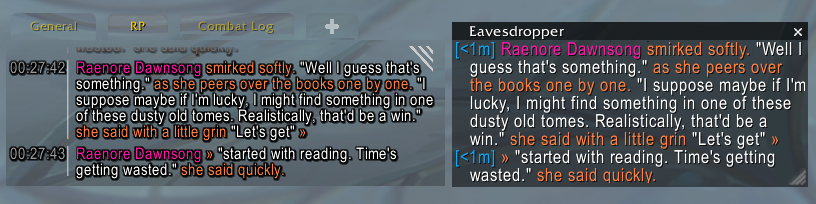
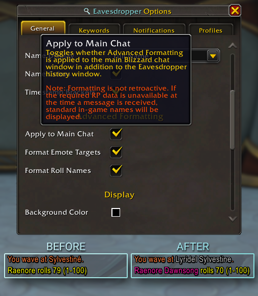

# Eavesdropper 🔍
Eavesdropper helps you stay immersed in busy RP environments by focusing on the interactions that matter most. 

**Key Features:**
- **Dedicated History:** A focused window for your current target or mouseover.
- **Keyword Highlights:** Custom keywords highlighted in chat with optional sound alerts.
- **Seamless Multi-Message Compatibility:** Built-in support for multi-message addons like Chattery, EmoteSplitter, and Yapper.
- **Advanced RP Name Formatting:** Replaces standard names with RP names in rolls and emotes (e.g., `/point`).

Available soon on [CurseForge](https://www.curseforge.com/wow/addons/), [Wago.io](https://addons.wago.io/addons/), and [WoWInterface](https://www.wowinterface.com/downloads/)!  

## History Window
Keep track of the conversation with a customizable frame that displays the recent action history of your target or mouseover.

**Customization Options:**
- **History Size:** Change the number of stored actions (default: 50).
- **Visuals:** Full control over window styling (background colors, opacity) and typography (font, size, etc.).
- **Name Formatting:** Choose how names appear: Full, First Name Only, or OOC.

### Filters
Toggle visibility on the fly. You can filter the history window to show only specific types of interactions at any time.

| "Public" Filter On | "Public" Filter Off |
| :-------------: | :-------------: |
|  |  |

## Keywords
Never miss a mention. Define custom keywords to be highlighted in the main chat window and set up optional audio notifications for when they are triggered.

## Multi-Message Support
Eavesdropper intelligently handles long-form RP by detecting split messages from various addons, ensuring your history window stays cohesive even when an emote spans multiple posts.

While Eavesdropper is designed to be broadly compatible, the following addons are **explicitly supported**:
- Chattery
- EmoteSplitter
- Yapper

## Advanced RP Name Formatting
Eavesdropper can replace standard character names in system emotes (like `/point` or `/wave`) and `/roll` results with their respective RP names.

> **Note:** This feature requires your client to have the player's RP data cached (via MSP) to function correctly.

  