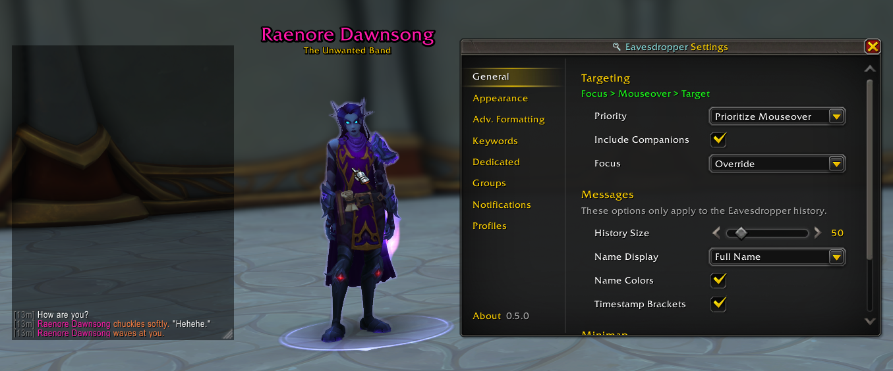
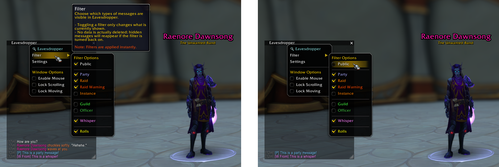
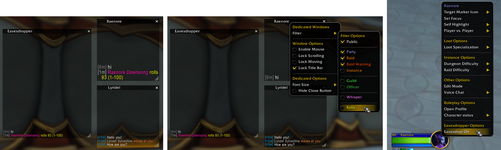
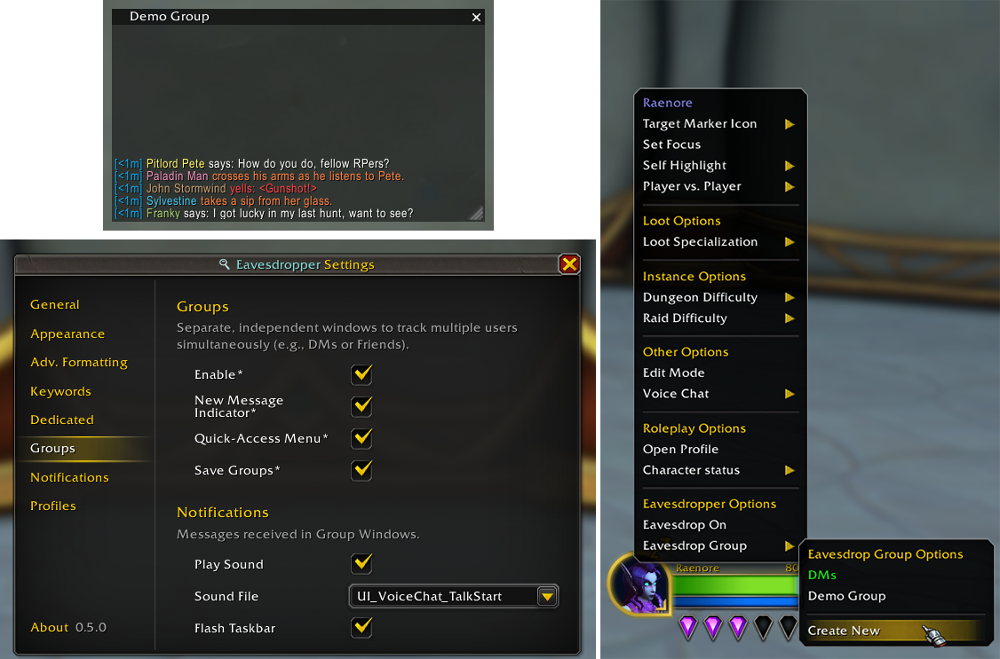
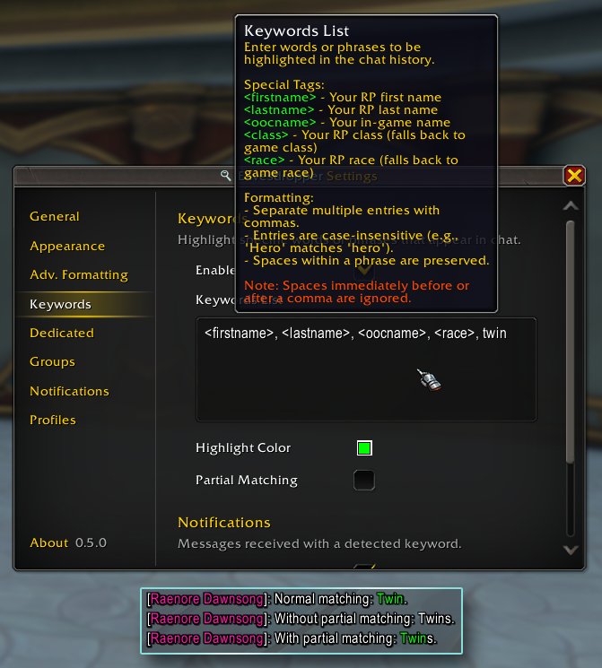
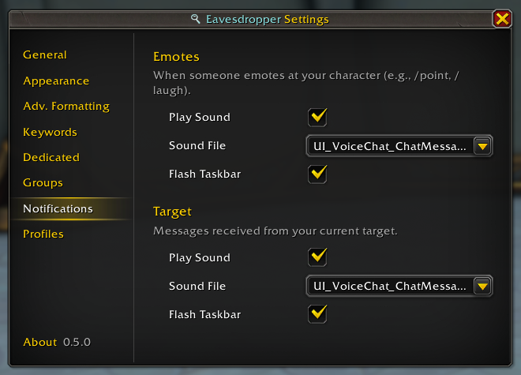
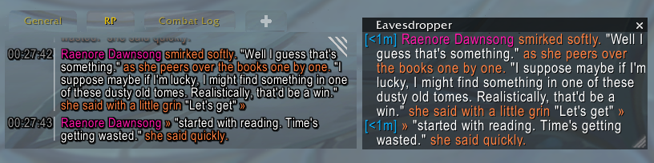
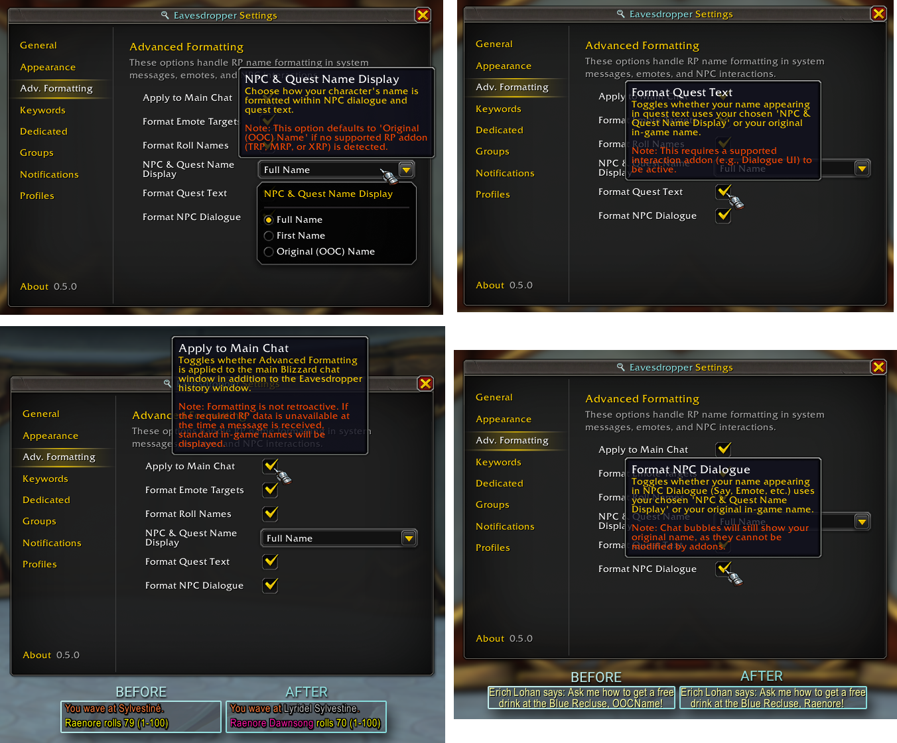
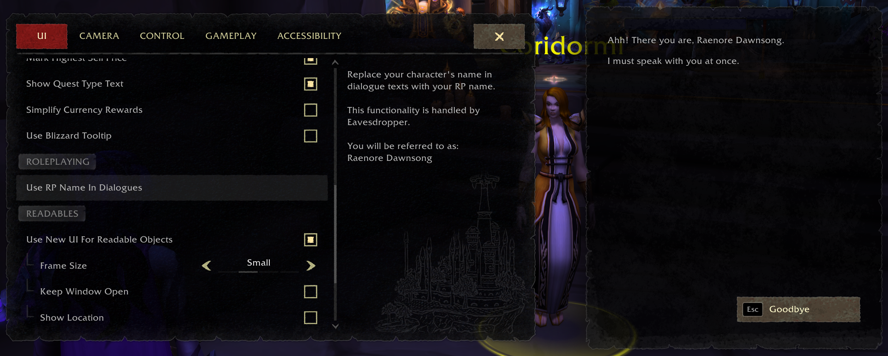

# Eavesdropper 🔍
Eavesdropper helps you stay immersed in busy RP environments by focusing on the interactions that matter most. 

**Key Features:**
- **History Window:** A focused, real-time feed for your current target or mouseover.
- **Dedicated Windows:** Create unique, independent windows for specific targets to track multiple conversations simultaneously.
- **Group Windows:** Combine multiple targets into a single shared window for party or small-group interactions.
- **Keyword Highlights:** Custom keywords highlighted in chat with optional sound alerts.
- **Notification Support:** Play a sound and flash the taskbar when your target performs an action, or when a Blizzard emote is directed at you, or a Dedicated Window receives a message.
- **Seamless Multi-Message Compatibility:** Built-in support for multi-message addons like Chattery, EmoteSplitter, and Yapper.
- **Advanced RP Name Formatting:** Replaces standard names with RP names in rolls, Blizzard emotes, NPC dialogue, and Quest Text (via Dialogue UI).

Available on [CurseForge](https://www.curseforge.com/wow/addons/eavesdropper), [Wago.io](https://addons.wago.io/addons/eavesdropper), and [WoWInterface](https://www.wowinterface.com/downloads/info27060-Eavesdropper.html)!  

## History Window
Keep track of the conversation with a customizable frame that displays the recent action history of your target or mouseover.

**Customization Options:**
- **History Size:** Change the number of stored actions displayed (default: 50).
- **Visuals:** Full control over window styling (background colors, opacity) and typography (font, size, etc.).
- **Name Formatting:** Choose how names appear: Full, First Name Only, or OOC.

### Filters
Toggle visibility on the fly. You can filter the history window to show only specific types of interactions at any time.

## Dedicated Windows
Create individual Eavesdropper windows for specific targets by right-clicking a unit portrait or chat name and selecting **"Eavesdrop On"**.

Each Dedicated Window has its own unique:
- Filters
- Font Size
- New Message indicator
- Notifications (Sounds & Flash)

**Note:** Dedicated Windows are session-based and do not persist through UI reloads or logouts.

  
*Click the image to view it in full size.*

## Group Windows
Consolidate interactions from multiple specific players into a single Eavesdropper window by right-clicking a unit portrait or chat name, select **"Eavesdrop Group"**, and either create a new group or add the player to an existing one.

Ideal for keeping track of a small party or a specific "circle" of characters within a crowded environment.

**Note:** Group Windows offer partial persistence: **Group Name**, **Player List**, and **Display Mode** are saved through UI reloads or logouts.

  
*Click the image to view it in full size.*

## Keywords
Never miss a mention. Define custom keywords to be highlighted in the main chat window and set up optional audio notifications for when they are triggered.

## Notifications
Eavesdropper can play a sound notification and flash the taskbar when:
- Your current target takes an action (e.g., `/say`, emotes, etc.).
- A Blizzard emote is directed at you (e.g., `/point` or `/wave`).
- A new message is received in a **Dedicated Window**.

## Multi-Message Support
Eavesdropper intelligently handles long-form RP by detecting split messages from various addons, ensuring your history window stays cohesive even when an emote spans multiple posts.

While Eavesdropper is designed to be broadly compatible, the following addons are **explicitly supported**:
- [Chattery](https://www.curseforge.com/wow/addons/chattery)
- [Emote Splitter](https://www.curseforge.com/wow/addons/emote-splitter)
- [Yapper](https://www.curseforge.com/wow/addons/yapper-post-splitter)

## Advanced RP Name Formatting
Eavesdropper can replace standard character names with their respective RP names across various situations:
- **Blizzard Emotes:** Replaces names in emotes like `/point`, `/wave`, or `/bow`.
- **Rolls:** Shows RP names in `/roll` results.
- **NPC Dialogue:** Replaces your name when NPCs speak to you in chat (`/say`, `/whisper`, etc.).
- **Quest Text:** Seamlessly integrates with **Dialogue UI** to show your RP name during quest interactions.

Eavesdropper can replace standard character names in system emotes (like `/point` or `/wave`) and `/roll` results with their respective RP names.

**Note:** This feature requires your client to have the player's RP data cached (via MSP) before the replacement can occur.

  
*Click the image to view it in full size.*
  
*Click the image to view it in full size.*
