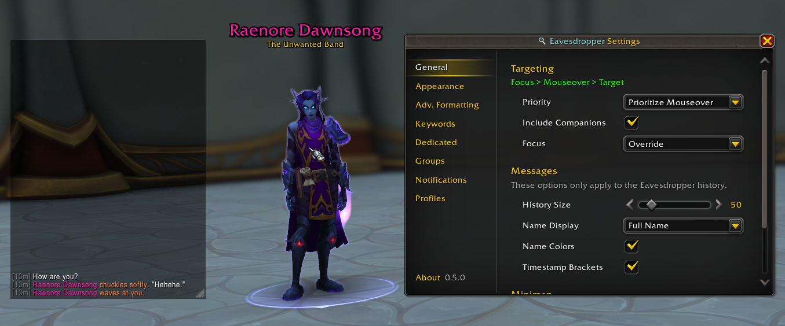
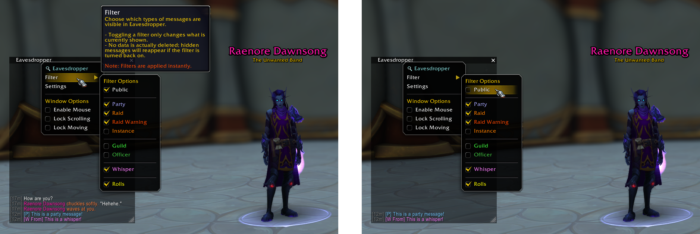
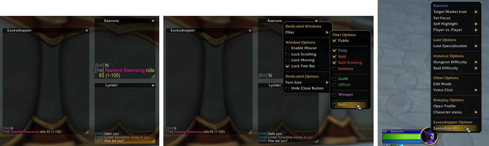
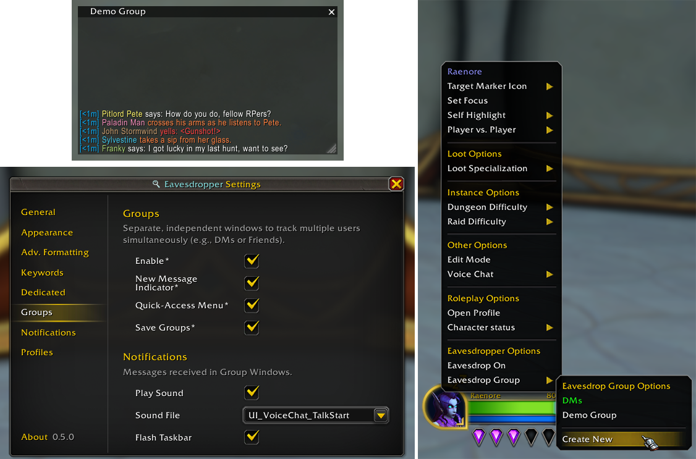
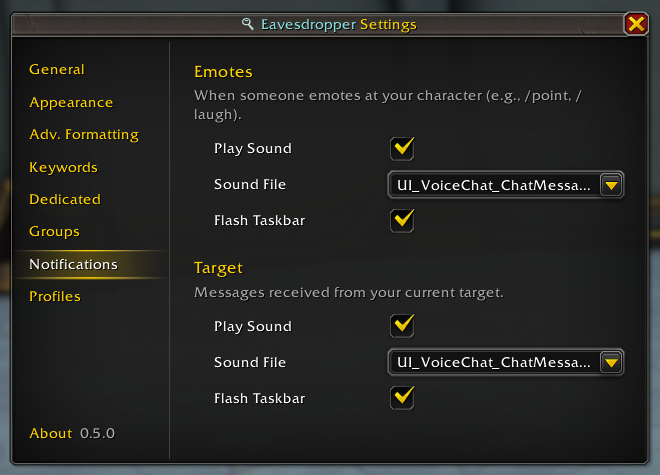
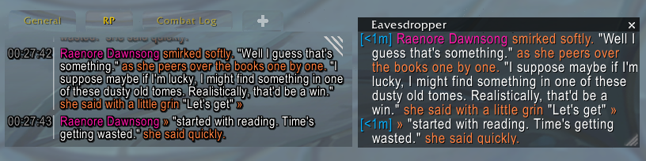
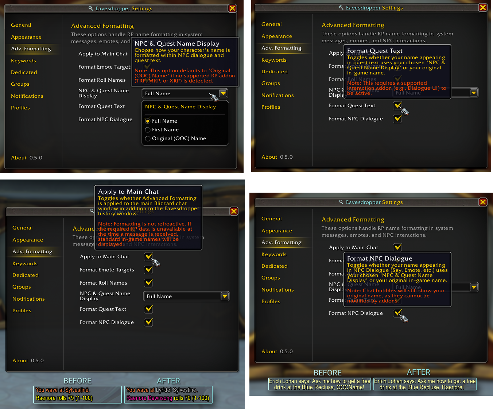
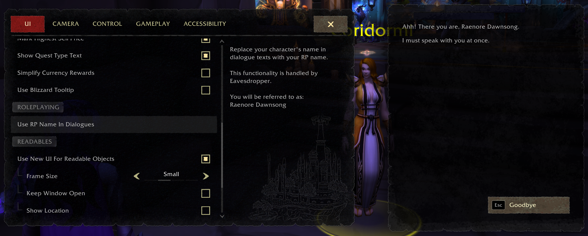

# Eavesdropper 🔍
Eavesdropper keeps you immersed in busy RP environments by tracking the conversations that matter most, exactly how you want to see them.

**Key Features:**
- **Main Window:** Real-time feed for your current target, mouseover, or focus.  
- **Dedicated Windows:** Independent windows per target, for tracking multiple conversations at once.  
- **Group Windows:** Combine multiple targets into one window for party or small-group RP.  
- **Mentions:** Every message aimed at you in one place, from keyword hits to Blizzard emotes (e.g. `/poke`, `/wave`).  
- **Copy History:** Copy any window's chat history out as plain text, right from its title-bar menu.  
- **Keyword Highlights:** Custom keywords highlighted in chat with optional sound alerts.  
- **Notification Support:** Play a sound and flash the taskbar on target actions, directed Blizzard emotes, or new Dedicated/Group messages.  
- **Multi-Message Support:** Built-in support for Chattery, EmoteScribe, EmoteSplitter, and Yapper.  
- **Advanced RP Name Formatting:** Replaces standard names with RP names in rolls, Blizzard emotes, NPC dialogue, and Quest Text (via Dialogue UI).  
- **Profiles & Sharing:** Manage per-character profiles and export/import setups or global account settings as text strings.  
- **Keybindings:** Open the Main Window, Settings, Mentions, or a Dedicated Window from Blizzard's **Options > Keybindings** menu.  
- **ElvUI:** Optional, toggleable ElvUI skinning.  
- **Localization:** Full English and French translations, with a partial Russian translation and more languages welcome.

Available on [CurseForge](https://www.curseforge.com/wow/addons/eavesdropper), [Wago.io](https://addons.wago.io/addons/eavesdropper), and [WoWInterface](https://www.wowinterface.com/downloads/info27060-Eavesdropper.html)!  

## Main Window
Track conversations easily with a customizable frame displaying recent action history for your target, mouseover, or focus unit.

The Main Window features:
- **Layout & Style:** Visuals (background color, opacity, font, size, etc.) and Name Formatting (Full, First Name Only, or OOC).
- **Behavior & Storage:** History Size (10–300, default: 50) and New Message Indicator (enabled by default under **Appearance > Display**).

**Interactions & Navigation:**
- **Sender Names:** Clickable sender names let you quickly interact with players. The target of a Blizzard emote is clickable too.
- **Quick Eavesdrop Actions:** Open a Dedicated Window or add to a Group Window for your current target, mouseover, or focus, right from the window's own menu.

### Filters
Toggle visibility on the fly. You can filter the Main Window to show only specific types of interactions at any time.

## Clean, Recognizable Layout
Each window type (Main, Dedicated, Group, and Mentions) features a distinct title bar icon and a subtle scrollbar that expands on hover, thanks to [Peterodox](https://www.curseforge.com/members/peterodox/projects) for the design contribution.

The chat frames are clean and focused, stripped of unnecessary visual clutter for quick, fluid navigation.

*Click the image to view it in full size.*

## Dedicated Windows
Create individual Eavesdropper windows for specific targets by right-clicking a unit portrait or chat name and selecting **"Eavesdrop On"**.

Each Dedicated Window features independent:
- **Layout & Style:** Position, Size, Font Size, and Name Display (Full/First/Original or Profile Default).
- **Behavior & Storage:** Filters, Notifications (Sound/Flash), and New Message Indicator (notifications and indicators only trigger for messages matching that window's specific filters).

> **Note:** As long as a Dedicated Window is open, it remembers its setup across `/reload`s and relogs. Reopening it mid-session brings back exactly how you left it.

**Interactions & Navigation:**
- **Sender Names:** Clickable sender names let you quickly interact with players. The target of a Blizzard emote is clickable too.
- **Quick Group Actions:** Add this window's target to a Group Window directly from the window's own menu.

  
*Click the image to view it in full size.*

## Group Windows
Consolidate interactions from multiple players into a single window by right-clicking a unit portrait or chat name and selecting **"Eavesdrop Group"**. Ideal for tracking a party or a specific "circle" of characters in crowded areas.

Each Group Window features independent:
- **Layout & Style:** Position, Size, Font Size, and Name Display (Full/First/Original or Profile Default).
- **Behavior & Storage:** Filters, Notifications (Sound/Flash), New Message Indicator, and History Size (10–1000, default: 100, independent of the Main Window).

> **Note:** As long as a Group Window is open, it remembers its setup and player list across `/reload`s and relogs. Reopening one with the same name lets you bring that back or start fresh.

**Interactions & Navigation:**
- **Sender Names:** Hover to underline and right-click for the standard player context menu (Whisper, Invite, Eavesdrop On). The target of a Blizzard emote is clickable too.
- **Jump to Context:** Opens the sender's Dedicated Window scrolled directly to that message, showing the surrounding conversation.
- **Player List Menu:** Access membership directly from the title bar (sorted by RP first name). Click **Add Target** to quickly add your current target, use checkboxes to toggle members on/off, or click the icon beside each member to jump straight to their Dedicated Window.

  
*Click the image to view it in full size.*

## Mentions
A dedicated window listing every message aimed at you, whether through keyword hits or Blizzard emotes (e.g. `/poke`, `/wave`), across all channels.

Open it via `/ed mentions`, **Shift-Right-Click** on the minimap icon, or by selecting **"Toggle Mentions"** in your unit popup menu.

The Mentions Window features independent:
- **Behavior & Storage:** Filters, New Message Indicator, History Size (10–1000, default: 300), Font Size, and a **Mention Types** filter to toggle keyword hits and Blizzard emotes independently.

> **Note:** Only new messages are checked. Older messages aren't rescanned when you add a keyword afterward.

**Interactions & Navigation:**
- **Sender Names:** Clickable sender names let you quickly interact with players.
- **Jump to Context:** Opens the sender's Dedicated Window scrolled directly to that message, showing the surrounding conversation.

  
*Click the image to view it in full size.*

## Keywords
Never miss a mention. Define custom keywords to highlight in Blizzard's chat window and configure optional audio notifications whenever they are triggered.

## Notifications
Configure Eavesdropper to play a sound notification or flash the taskbar when:  
- Your current target takes an action (e.g., `/say`, emotes, etc.).  
- A Blizzard emote is directed at you (e.g., `/point` or `/wave`).  

> **Note:** Notifications for Dedicated and Group Windows are configured individually within their respective *Dedicated* and *Group* settings pages.

## Multi-Message Support
Eavesdropper intelligently handles long-form RP by detecting split messages from various addons, ensuring your Main Window stays cohesive even when an emote spans multiple posts.

While Eavesdropper is designed to be broadly compatible, the following addons are **explicitly supported**:
- [Chattery](https://www.curseforge.com/wow/addons/chattery)
- [EmoteScribe](https://www.curseforge.com/wow/addons/emotescribe)
- [Emote Splitter](https://www.curseforge.com/wow/addons/emote-splitter)
- [Yapper](https://www.curseforge.com/wow/addons/yapper-post-splitter)

  
*Multi-message support in action with **Chattery** (utilizing the "Enable RP Formatting" setting).*

## Advanced RP Name Formatting
Eavesdropper can replace standard character names with their respective RP names across the entire UI.  
This formatting applies to **all Eavesdropper windows** (Main, Dedicated, Group, and Mentions) and can optionally be enabled for **Blizzard's chat window** (via the **Apply to Main Chat** setting), complete with its own independent name format setting. Turning it on, or changing that name format, also updates messages already on screen instead of only new ones.

**Supported Situations:**
- **Blizzard Emotes:** Replaces names in emotes like `/point`, `/wave`, or `/bow`.
- **Rolls:** Shows RP names in `/roll` results.
- **NPC Dialogue:** Replaces your name when NPCs speak to you in chat and in their speech bubbles (`/say`, `/whisper`, etc.).
- **Quest Text:** Seamlessly integrates with **Dialogue UI** to display your RP name during quest interactions.

> **Note:** This only works once you've already loaded the player's RP profile, for example by having seen them before.

**Compatibility:** If you're using the standalone addon **Total RP 3: RP Name in Quest Text** for NPC dialogue or speech, Eavesdropper steps aside so the two addons don't rename the same text twice.

  
*Click any image to view it in full size.*

## Profiles & Sharing
Every character can run its own profile, ensuring your Human and Void Elf character maintain distinct setups. Profiles are managed under **Settings > Profiles**, where you can create, copy, rename, reset, and delete them.

**Import & Export:**
Export either your **Profile** (window styling, filters, keywords, notifications) or your **Account Settings** (options shared across all profiles, such as minimap button visibility) as a shareable text string for backups or sharing.

- **Clear Labels:** Exports are labeled with their profile name, date, and version, so old backups are easy to identify.
- **Name Selection & Overwrite Protection:** Choose which profile name to import into, with a prompt warning you before overwriting an existing setup.
- **Error-Proof:** A broken or outdated setting won't stop an import. Eavesdropper works around it and tells you what changed.

  
*Click the image to view it in full size.*

## Localization
Eavesdropper is fully translated into **English** and **French**, with a partial **Russian** translation also available.

Translations for other languages are always welcome. If you would like to help translate Eavesdropper, feel free to open an issue or pull request on [GitHub](https://github.com/Raenore/Eavesdropper).
